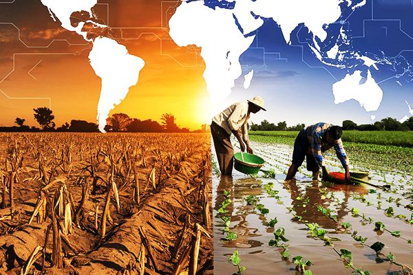
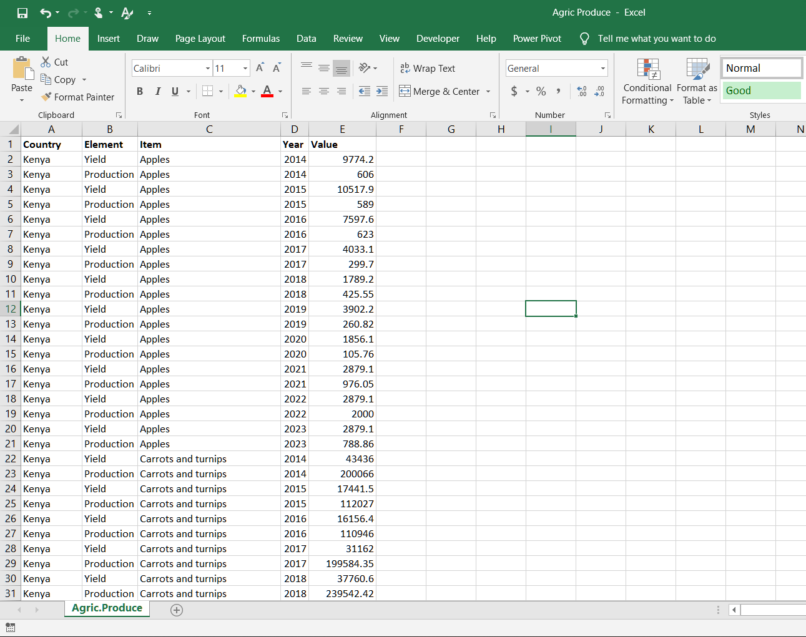
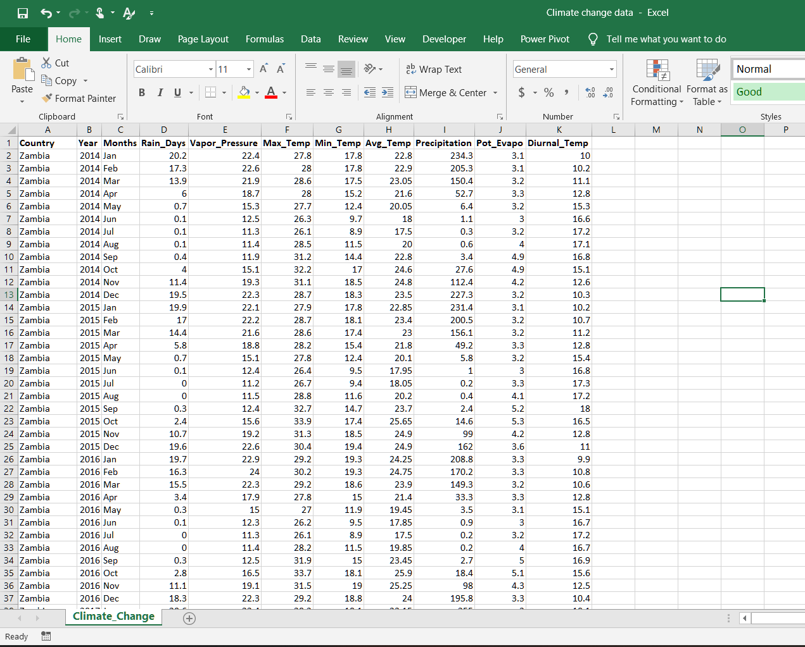

# Tackling Climate Change Impact on Agriculture in Africa

 

## Table of Content
- Introduction
- Data collection and preparation
- Understanding the dataset
- Tools used
- Data cleaning, preparation and Transformation
- Climate Change and Agriculture: How African Nations Are Adapting
- Visualization
- High Predictive Accuracy: Climate and Country-Specific Factors Matter
- Conclusion and Key Recommendations

## Introduction
Africa, a land of rich soil and diverse climates, has long been known as an agricultural powerhouse. From the sprawling maize fields of Zambia to Nigeria’s vast cassava plantations, farming is not just a way of life, it’s the backbone of economies, cultures, and food security. But there’s a storm brewing, quite literally. Climate change is disrupting weather patterns, making rainfall unpredictable, temperatures unbearable, and droughts more frequent.

For farmers who rely on stable seasons, this is like playing a game where the rules keep changing. Too much heat? Crops wither. Too much rain? Fields flood. Too little rain? Yields plummet. These changes are not just affecting smallholder farmers; they are shaking entire food systems, pushing millions toward food insecurity.

This study takes a deep dive into five African countries, Kenya, Nigeria, South Africa, Sudan, and Zambia, to understand how rising temperatures, shifting rainfall patterns, and other climate factors affect agricultural productivity. The goal? To uncover trends, highlight key climate factors that drive productivity up or down, and propose practical solutions. The ultimate vision is to equip policymakers, stakeholders, and organizations with actionable strategies to secure Africa’s agricultural future in the face of climate uncertainty.

This research is also a step toward the broader global mission of achieving the Sustainable Development Goals (SDGs), specifically SDG 2 (Zero Hunger) and SDG 13 (Climate Action). By tackling climate-related agricultural challenges head-on, we take a step closer to a food-secure Africa and a more resilient planet

## Data Collection and Preparation
To understand how climate change is affecting agriculture, I needed two key datasets:

1.	Agricultural Output Data (2014-2023) – Sourced from the Food and Agriculture Organization (FAO), this dataset includes information on crop yields and total production for five African countries: Nigeria, Zambia, Kenya, Sudan, and South Africa.
2.	Climate Change Data (2014-2023) – Extracted from crudata.uea.ac.uk, this dataset provides climate-related factors affecting agriculture in these same countries.

I combined both datasets to analyze trends and find relationships between climate factors and agricultural productivity.

## Understanding the Dataset
#### Crop Production Data (2,341 rows)
This dataset focuses on agricultural output. Here’s what each column means:
- Country – The country where the data was recorded (Nigeria, Zambia, Kenya, Sudan, or South Africa).
- Element – Indicates whether the value represents yield (how much crop is produced per hectare) or total production (overall crop output in tons).
- Items – The specific crop type being measured.
- Year – The year the data was collected (ranging from 2014 to 2023).
- Value – The numerical measurement of the element (either yield or total production).

  

#### Climate Change Data (51 rows)
This dataset records climate conditions over the same years. Each column represents:
- Country – The country where climate data was recorded.
- Year – The year of observation (2014-2023).
- Months – Climate data is initially recorded by month before being aggregated by year.
- Rain Days – The total number of days with rainfall in a year.
- Vapor Pressure – The amount of water vapor in the air, measured in hectopascals (hPa), affecting plant water absorption.
- Maximum Temperature – The highest recorded temperature in a given year (°C).
- Minimum Temperature – The lowest recorded temperature in a given year (°C).
- Average Temperature – The yearly average of daily temperatures (°C).
- Precipitation – The total amount of rainfall in a year, measured in millimeters (mm).\
- Potential Evapotranspiration (PET) – The amount of water that could be lost from soil and plants due to evaporation and transpiration, measured in mm/day.
- Diurnal Temperature Range – The difference between the highest and lowest temperatures recorded in a day (°C), affecting crop stress levels.

Tools Used
To clean, transform, and analyze the data, I used:
•	Excel – For initial data processing, formulas, and structuring.
•	Power Query – For merging and transforming data efficiently.
•	DAX (Data Analysis Expressions) – For creating key performance indicators (KPIs) and calculated metrics in Power BI.
•	Power BI – For visualization, trend analysis, and generating insights.
•	Gretl – for developing predictive model

