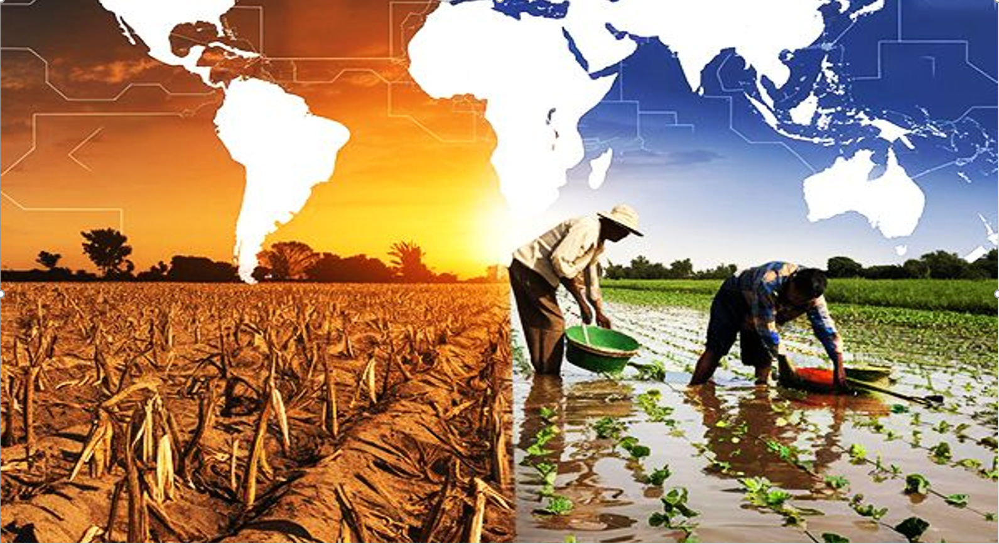
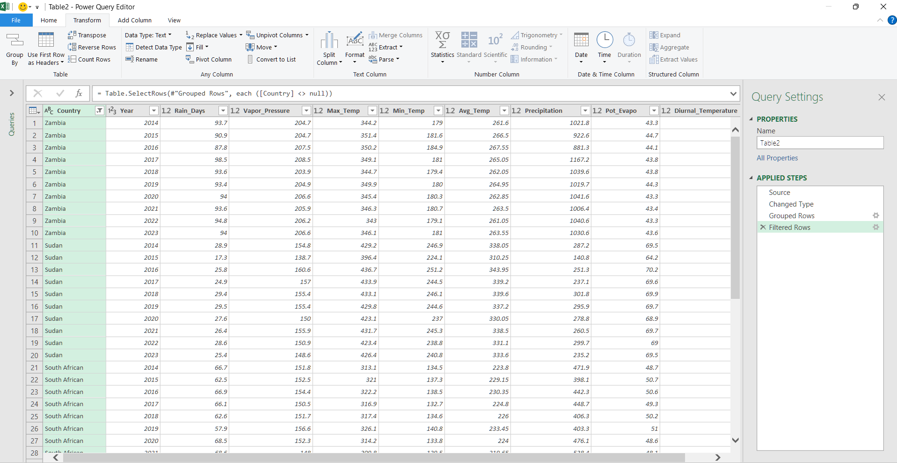
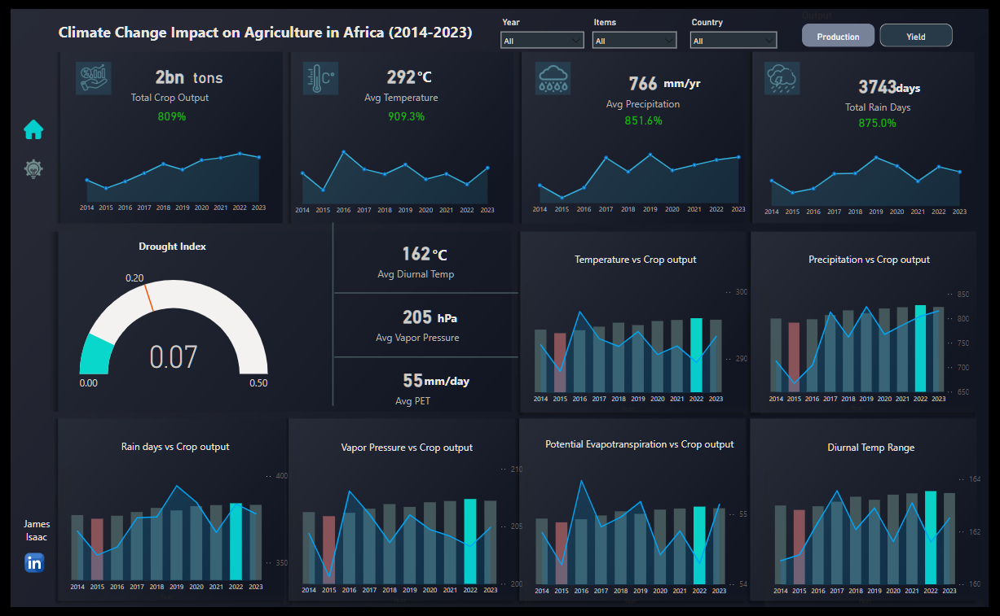
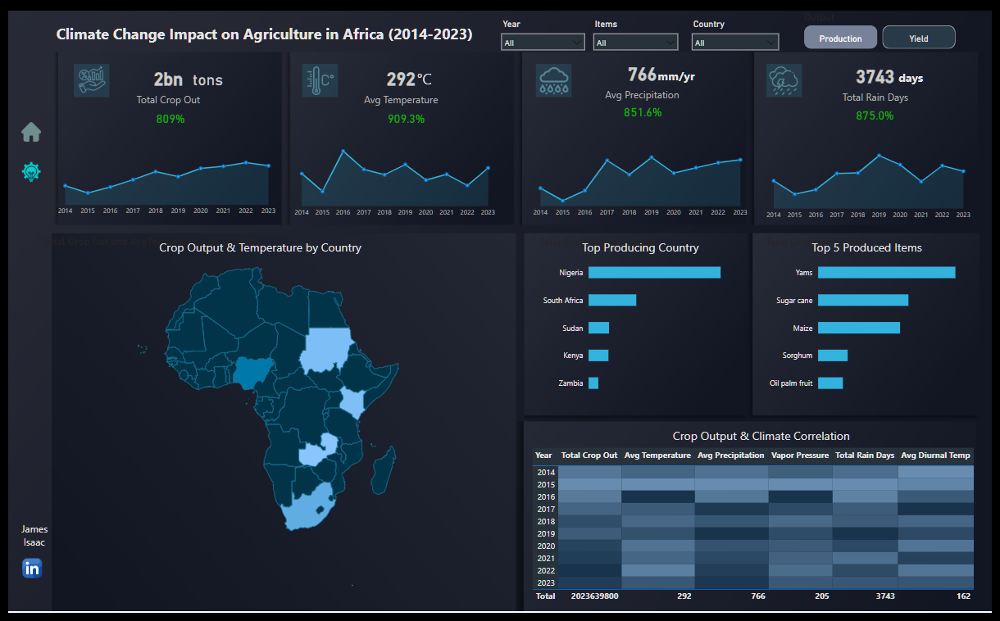
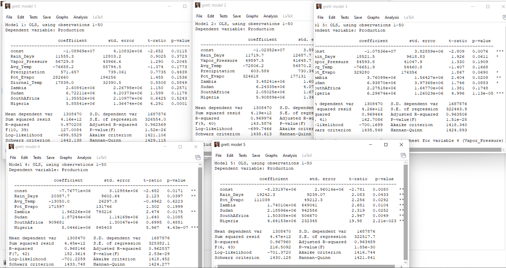
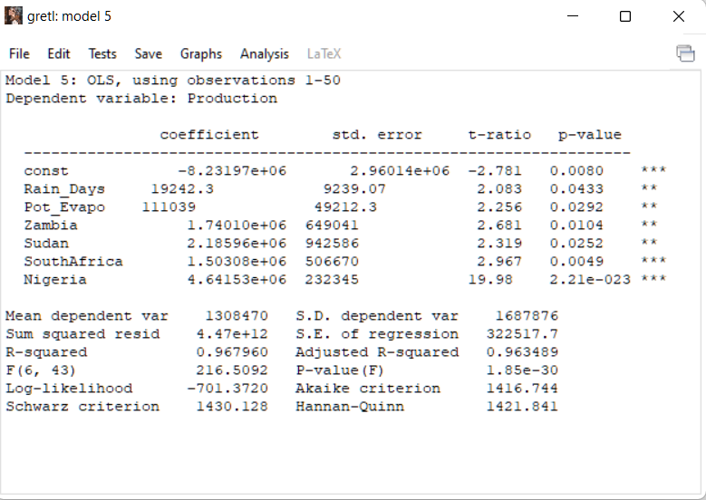

# Tackling Climate Change Impact on Agriculture in Africa

 

## Table of Content
- Introduction
- Data collection and preparation
- Understanding the dataset
- Tools used
- Data cleaning, preparation and Transformation
- Visualization
- Climate Change and Agriculture: How African Nations Are Adapting
- High Predictive Accuracy: Climate and Country-Specific Factors Matter
- Conclusion and Key Recommendations

## Introduction
Africa, a land of rich soil and diverse climates, has long been known as an agricultural powerhouse. From the sprawling maize fields of Zambia to Nigeria’s vast cassava plantations, farming is not just a way of life, it’s the backbone of economies, cultures, and food security. But there’s a storm brewing, quite literally. Climate change is disrupting weather patterns, making rainfall unpredictable, temperatures unbearable, and droughts more frequent.

For farmers who rely on stable seasons, this is like playing a game where the rules keep changing. Too much heat? Crops wither. Too much rain? Fields flood. Too little rain? Yields plummet. These changes are not just affecting smallholder farmers; they are shaking entire food systems, pushing millions toward food insecurity.

This study takes a deep dive into five African countries, Kenya, Nigeria, South Africa, Sudan, and Zambia, to understand how rising temperatures, shifting rainfall patterns, and other climate factors affect agricultural productivity. The goal? To uncover trends, highlight key climate factors that drive productivity up or down, and propose practical solutions. The ultimate vision is to equip policymakers, stakeholders, and organizations with actionable strategies to secure Africa’s agricultural future in the face of climate uncertainty.

This research is also a step toward the broader global mission of achieving the Sustainable Development Goals (SDGs), specifically SDG 2 (Zero Hunger) and SDG 13 (Climate Action). By tackling climate-related agricultural challenges head-on, we take a step closer to a food-secure Africa and a more resilient planet

## Data Collection and Preparation
To understand how climate change is affecting agriculture, I needed two key datasets:

1.	Agricultural Output Data (2014-2023) – Sourced from the Food and Agriculture Organization (FAO), this dataset includes information on crop yields and total production for five African countries: Nigeria, Zambia, Kenya, Sudan, and South Africa.
2.	Climate Change Data (2014-2023) – Extracted from crudata.uea.ac.uk, this dataset provides climate-related factors affecting agriculture in these same countries.

I combined both datasets to analyze trends and find relationships between climate factors and agricultural productivity.

## Understanding the Dataset
### Crop Production Data (2,341 rows)
This dataset focuses on agricultural output. Here’s what each column means:
- Country – The country where the data was recorded (Nigeria, Zambia, Kenya, Sudan, or South Africa).
- Element – Indicates whether the value represents yield (how much crop is produced per hectare) or total production (overall crop output in tons).
- Items – The specific crop type being measured.
- Year – The year the data was collected (ranging from 2014 to 2023).
- Value – The numerical measurement of the element (either yield or total production).

 ### Climate Change Data (51 rows)
This dataset records climate conditions over the same years. Each column represents:
- Country – The country where climate data was recorded.
- Year – The year of observation (2014-2023).
- Months – Climate data is initially recorded by month before being aggregated by year.
- Rain Days – The total number of days with rainfall in a year.
- Vapor Pressure – The amount of water vapor in the air, measured in hectopascals (hPa), affecting plant water absorption.
- Maximum Temperature – The highest recorded temperature in a given year (°C).
- Minimum Temperature – The lowest recorded temperature in a given year (°C).
- Average Temperature – The yearly average of daily temperatures (°C).
- Precipitation – The total amount of rainfall in a year, measured in millimeters (mm).\
- Potential Evapotranspiration (PET) – The amount of water that could be lost from soil and plants due to evaporation and transpiration, measured in mm/day.
- Diurnal Temperature Range – The difference between the highest and lowest temperatures recorded in a day (°C), affecting crop stress levels.

Agriculture Dataset               | Climate Dataset
:--------------------------------:|:-------------------------:
                |  

## Tools Used
To clean, transform, and analyze the data, I used:
- Excel – For initial data processing, formulas, and structuring.
- Power Query – For merging and transforming data efficiently.
- DAX (Data Analysis Expressions) – For creating key performance indicators (KPIs) and calculated metrics in Power BI.
- Power BI – For visualization, trend analysis, and generating insights.
- Gretl – for developing predictive model

## Data Cleaning, Preparation, and Transformation
Before analysis, I had to clean and structure the data:
- Aggregating Climate Data – Climate factors were originally recorded monthly. I grouped them by Country and Year, summing values where necessary to get annual totals. This was done using Power Query.
- Creating a Unique ID – To establish a relationship between the two datasets, I generated a unique ID column for both tables using the INDEX-MATCH function in Excel.
- Data Modeling in Power BI – Since each climate record was unique per year and country, I created a one-to-many relationship between the climate table (one side) and the crop production table (many side).
- Calculating Key Measures – Using DAX, I computed essential measures such as average yield per year, precipitation impact on productivity, and temperature trends.
With this structured data model, I was able to analyze how climate variables impact agricultural productivity across different countries and time periods.

## Visualization

[Interact with Report here](https://app.powerbi.com/view?r=eyJrIjoiYWI3MTAxZjktMzI3MS00ZmE2LTk0YmUtNDYxMTY4NjI4M2Y0IiwidCI6IjZiYjI1Yjk2LTlhZTItNDkxMy1hZTYxLThmOGE3NDNjYTY5NiJ9)

## Climate Change and Agriculture: How African Nations Are Adapting
As climate change continues to reshape Africa’s agricultural landscape, countries are experiencing varied impacts on crop production. While some nations are struggling with droughts and extreme temperatures, others are adapting with innovative farming techniques. A closer look at Kenya, Nigeria, South Africa, Sudan, and Zambia reveals both challenges and solutions in the fight for food security.

#### Kenya: A Delicate Balance
Kenya’s agriculture tells a complex story—more rain does not always guarantee better harvests.
- In 2022, Kenya produced 19 million tons of crops despite high temperatures (30.6°C) and 99 rainy days.
- However, in 2017, the country recorded only 14 million tons, even with more rain (1038mm) and more rainy days (104).
What’s going wrong? The drought index remained low, meaning rainfall wasn’t the problem. Instead, unstable temperatures and extreme day-to-night temperature swings weakened crops, leading to lower yields.
##### Key Challenges
- High water loss due to evaporation, making irrigation a necessity.
- Large temperature swings stressing plants and reducing resilience.
##### Proposed Solutions
- Adopt drip irrigation to optimize water use.
- Develop climate-resilient crop varieties that can tolerate extreme temperatures.
- Promote reforestation to stabilize local climates.

#### Nigeria: The Heat is On
Nigeria is a leader in African agriculture, but rising temperatures are beginning to impact productivity.
- 2022 was a strong year, with 129 million tons of crops, supported by 85 rain days and 1241mm of precipitation.
- However, in 2014, production dropped to 101 million tons, coinciding with higher temperatures (33.2°C) and less rainfall (1162mm).
The trend is clear: as temperatures rise, crop yields decline. When extreme heat sets in, crops struggle to absorb moisture, leading to soil degradation and reduced harvests.
##### Key Challenges
- Rising temperatures are making farming more difficult.
- Short rainy seasons are limiting water supply.
##### Proposed Solutions
- Introduce heat-resistant crops to sustain production.
- Implement mulching techniques to retain soil moisture.
- Develop drought insurance programs to protect farmers financially.

#### South Africa: Fighting Against Dry Conditions
With a naturally dry climate, South Africa’s farmers have learned to adapt. However, water scarcity remains a persistent challenge.
- In 2023, crop production peaked at 46 million tons, supported by 517mm of rainfall and 68 rain days.
- In contrast, 2016 saw production drop to 32 million tons, despite similar conditions, though a slightly lower rainfall (442mm) and a higher drought index made the difference.
##### Key Challenges
- Low annual rainfall (442-517mm) makes water management crucial.
- High evaporation rates further reduce available water.
##### Proposed Solutions
- Expand rainwater harvesting to store water for dry periods.
- Promote no-till farming to improve soil moisture retention.
- Support climate-smart agriculture, including rotational grazing to protect farmland.

#### Sudan: Surviving in Extreme Drought
Sudan faces some of Africa’s harshest climate conditions, with long dry spells and extreme heat.
- In 2018, 22 million tons of crops were produced despite only 302mm of rainfall and 29 rain days.
- However, 2015 was a devastating year, with only 14 million tons, as rainfall dropped to 141mm with just 17 rainy days.
With one of the highest drought indexes (0.23-0.46) in Africa, Sudanese agriculture remains extremely vulnerable to water shortages.
##### Key Challenges
- Severe drought conditions make farming unpredictable.
- Very low rainfall and short wet seasons limit water supply.
##### Proposed Solutions
- Expand irrigation networks to bring water to key farming areas.
- Promote agroforestry to improve soil moisture and prevent desertification.
- Develop drought-resistant crop varieties tailored to Sudan’s climate.

#### Zambia: A Surprisingly Stable Case
Compared to other African nations, Zambia’s climate is relatively stable. However, agricultural output still fluctuates, indicating other underlying factors.
- In 2018, Zambia produced 10 million tons of crops with 1031mm of rainfall and 94 rain days.
- Yet in 2015, production fell to 8 million tons, despite nearly identical climate conditions.
This suggests that non-climate factors such as soil fertility and pest outbreaks may be influencing yields.
##### Key Challenges
- Minimal climate variation, yet unpredictable production rates.
- Stable water availability, but unexplained fluctuations in crop output.
##### Proposed Solutions
- Improve soil fertility with organic fertilizers and sustainable land management.
- Enhance pest control using Integrated Pest Management (IPM).
- Provide farmer training programs to promote best agricultural practices.

#### Conclusion: Africa’s Agriculture at a Crossroads
The effects of climate change on Africa’s agricultural sector vary widely, but the common challenge remains: ensuring food security despite shifting weather patterns.
- Countries like Sudan face extreme drought, requiring urgent irrigation solutions.
- Nigeria’s challenge is rising temperatures, demanding heat-resistant crops and moisture management.
- Kenya’s fluctuating yields show the need for stable temperature conditions and better irrigation.
- South Africa and Zambia highlight the importance of smart water management and sustainable farming practices.
As the continent’s population grows, investing in climate-smart agriculture and resilient farming techniques will be key to ensuring long-term food security. The time to act is now.

## High Predictive Accuracy: Climate and Country-Specific Factors Matter

Backward Elimination              | Fitted Model
:--------------------------------:|:-------------------------:
                   |   

The model, built using the Backward Elimination method in Gretl, achieved a remarkable 96.79% accuracy, showing that nearly all variations in crop production can be explained by climate-related factors and country-specific agricultural conditions. However, beyond just rainfall and temperature, government policies, infrastructure, and land management strategies also play crucial roles.

### Rain and Evaporation: A Double-Edged Sword
One of the key takeaways from the study is the impact of Rain Days and Potential Evapotranspiration (PET)—the amount of water lost due to evaporation and plant transpiration. The findings confirm that more rainfall generally boosts crop production, as water availability is a major determinant of agricultural success.
On the other hand, high evaporation rates also show a surprising positive effect on crop yield. This could mean that in certain conditions, warmer temperatures and higher PET enhance plant growth by improving transpiration efficiency. However, excessive heat remains a concern, as prolonged droughts can reverse this benefit.

### The Agricultural Giants: Nigeria, Sudan, and South Africa
The study highlights striking differences between African countries. Nigeria emerges as the most influential player in agricultural output, with the highest recorded crop production. Sudan, Zambia, and South Africa also exhibit significant agricultural activity, but their dependence on climate factors varies.
- Nigeria leads the pack, with a strong agricultural base that continues to thrive despite extreme weather fluctuations
- South Africa benefits from advanced irrigation techniques, which help mitigate climate risks.
- Sudan, while having high agricultural potential, is particularly vulnerable to inconsistent rainfall and extreme temperatures.
- Zambia’s crop production shows notable sensitivity to weather changes, suggesting the need for adaptive farming strategies.

### The Bigger Picture: Food Security at Risk?
These findings emphasize a critical point: climate change is reshaping Africa’s agricultural landscape. While some regions adapt and maintain high productivity, others struggle under the weight of unpredictable weather patterns.
For policymakers and agricultural stakeholders, the message is clear—investing in climate-smart farming, efficient irrigation systems, and sustainable land practices is no longer optional but a necessity. Without proactive measures, the risk of food shortages and economic instability will only intensify in the coming years.

## Conclusion and Key Recommendations

The findings confirm that climate variability significantly impacts agriculture, but its effects differ across regions. Some countries (like Sudan and Nigeria) suffer from extreme heat and irregular rainfall, while others (like South Africa and Kenya) deal with arid conditions or unstable temperature swings. Climate factors like rainfall and evaporation rates significantly affect African agriculture, but they do not act alone. National policies, infrastructure, and agricultural innovations also determine how well a country can withstand climate stress. As the world grapples with climate change, Africa’s ability to adapt will be key to ensuring food security for its growing population.
Top Solutions for a Resilient Future:
1.	Climate-Smart Farming – Invest in heat-resistant crops and better irrigation.
2.	Water Conservation Strategies – Promote rainwater harvesting and soil moisture protection.
3.	Government Policies – Strengthen farmer support programs and risk management initiatives.
4.	Education & Training – Equip farmers with climate adaptation techniques.
5.	Technology & Data – Use climate data to predict trends and improve decision-making.
   
By taking action now, Africa can build a more climate-resilient agricultural sector, ensuring food security for future generations. The clock is ticking—adaptation isn’t a choice, it’s a necessity.

By James Isaac

